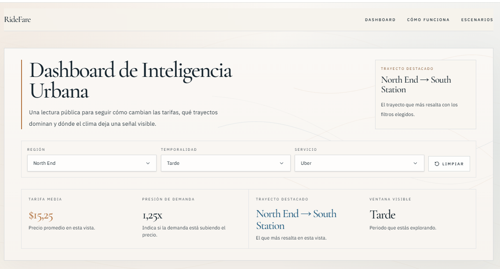
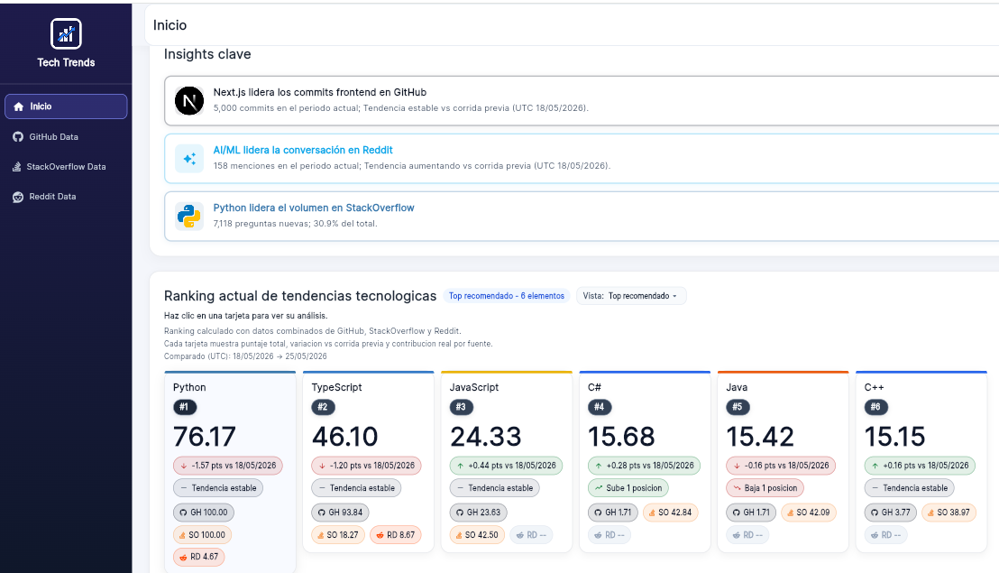
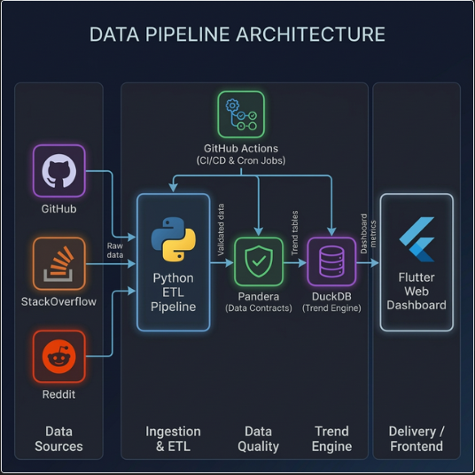
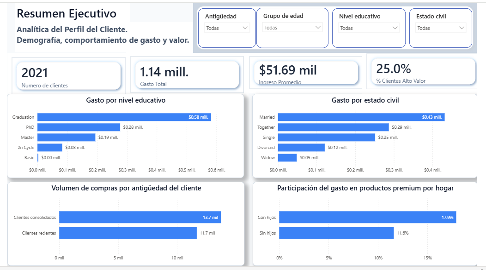
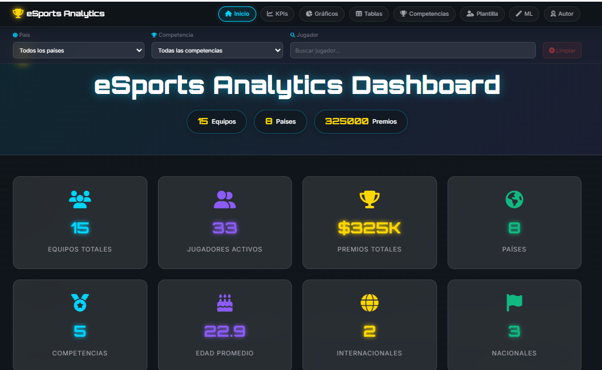

  

  <!-- Top Value Proposition Animation -->
  

   
  <h2>Junior Data Engineer &amp; Data Analyst | Building Reliable Pipelines + BI-Ready Data Products</h2>
  
I turn messy, multi-source data into <strong>validated pipelines</strong>, <strong>analytics-ready models</strong>, and <strong>decision-focused dashboards</strong>.

  
<strong>Proof of impact:</strong> <strong>133+ automated tests</strong> · <strong>1.2M+ records processed</strong> · <strong>up to 40% faster SQL workloads</strong> · <strong>$16.66K opportunity identified</strong>

  
📍 Guayaquil, Ecuador · Open to <strong>Trainee / Junior Data Engineer</strong> and <strong>Data Analyst / BI Analyst</strong> roles · <strong>Remote / Hybrid LATAM-US</strong>

  

    
    
    
    
  

---

## ⚡ Recruiter Snapshot

| Area | Signal |
|:--|:--|
| **Target roles** | Trainee / Junior Data Engineer · Data Analyst / BI Analyst |
| **Main value** | I build reliable data pipelines and turn them into BI-ready decision products |
| **Engineering proof** | 133+ tests · Pandera validation · DuckDB/dbt · CI/CD · scheduled workflows |
| **Analytics proof** | Power BI dashboards · DAX · KPI modeling · revenue gap analysis |
| **Business impact** | $16.66K opportunity identified · 1.2M+ records processed · up to 40% faster SQL workloads |
| **Availability** | Remote / Hybrid · LATAM / US-friendly teams |

---

## 🧭 Dual Track Positioning

<table>
  <tr>
    <td width="50%" valign="top">
      <h3>🛠️ Data Engineering Track</h3>
      
<strong>I build reproducible data systems with validation, testing, and automated delivery.</strong>

      <ul>
        <li>ETL/ELT pipeline development.</li>
        <li>Data contracts and quality gates with Pandera.</li>
        <li>DuckDB/dbt analytical transformation layers.</li>
        <li>CI/CD validation and scheduled refresh workflows.</li>
        <li>Versioned artifacts and runbooks for maintainable delivery.</li>
      </ul>
      
🔗 <strong>Best-fit projects:</strong>

      <ul>
        <li><a href="https://ride-fare-etl-pipeline-web.vercel.app/">RideFare — Pricing Intelligence Platform</a></li>
        <li><a href="https://sam-24-dev.github.io/Technology-trend-analysis-platform/">Technology Trend Analysis Platform</a></li>
      </ul>
    </td>
    <td width="50%" valign="top">
      <h3>📊 Data Analysis / BI Track</h3>
      
<strong>I translate data into KPI models, dashboards, and business recommendations.</strong>

      <ul>
        <li>KPI definition and business metric modeling.</li>
        <li>Power BI dashboards for executive reporting.</li>
        <li>DAX measures and storytelling layouts.</li>
        <li>Customer, seller and market segmentation.</li>
        <li>Insight-to-action recommendations for stakeholders.</li>
      </ul>
      
🔗 <strong>Best-fit projects:</strong>

      <ul>
        <li><a href="https://app.powerbi.com/view?r=eyJrIjoiNzE3YmU3ZDktN2M3Yi00ODY5LTk2OTktOGI0NmE3YmU1ZDdiIiwidCI6ImI3YWY4Y2FmLTgzZDgtNDY0NC04NWFlLTMxN2M1NDUyMjNjMSIsImMiOjR9&pageName=b29252d974b9cb52bd7f">Customer Profile Analytics Dashboard</a></li>
        <li><a href="https://app.powerbi.com/view?r=eyJrIjoiOTk5YTE0MjItZTNiOC00ZmI0LWI1NDUtZDY2ZThjZTYxYmQ0IiwidCI6ImI3YWY4Y2FmLTgzZDgtNDY0NC04NWFlLTMxN2M1NDUyMjNjMSIsImMiOjR9">Grocery Sales BI Dashboard</a></li>
        <li><a href="https://sam-24-dev.github.io/eSports-Analytics-Dashboard/">eSports Analytics Dashboard LATAM</a></li>
      </ul>
    </td>
  </tr>
</table>

---

## 📌 Impact Metrics

| Metric | Proof of Impact |
|:--|:--|
| ✅ **133+ automated tests** | Production-style data platforms with CI quality gates |
| ⚡ **Up to 40% faster queries** | SQL tuning and indexing for analytical workloads |
| 💰 **$16.66K performance gap identified** | BI analysis for business decision prioritization |
| 📦 **1.2M+ records processed** | Dynamic pricing pipeline with explainable ML artifacts |
| 🧪 **126 tests in eSports project** | Reliable ETL + analytics delivery workflow |

---

## 🧪 Portfolio Quality Index

Automated audit of flagship projects (CI/CD, tests, docs, demos, and latest updates).

<!-- PORTFOLIO-QUALITY:START -->

| Project | CI/CD | Tests | Docs | Demo | Last update | Signal |
|:--|:--:|:--:|:--:|:--:|:--:|:--|
| [RideFare](https://github.com/Sam-24-dev/RideFare-ETL-Pipeline) | ✅ | ✅ | [✅](https://github.com/Sam-24-dev/RideFare-ETL-Pipeline/blob/master/docs/arquitectura.png) | [✅](https://ride-fare-etl-pipeline-web.vercel.app/) | 2026-05-11 | CLI pipeline · Pandera · DuckDB/dbt · ML artifacts |
| [Technology Trends](https://github.com/Sam-24-dev/Technology-trend-analysis-platform) | ✅ | ✅ | [✅](https://github.com/Sam-24-dev/Technology-trend-analysis-platform/blob/main/docs/architecture/data-pipeline-architecture.png) | [✅](https://sam-24-dev.github.io/Technology-trend-analysis-platform/) | 2026-06-01 | Multi-source ETL · data contracts · scheduled refresh |
| [Customer Profile](https://github.com/Sam-24-dev/customer-profile-analytics-powerbi) | — | — | [✅](https://github.com/Sam-24-dev/customer-profile-analytics-powerbi#readme) | [✅](https://app.powerbi.com/view?r=eyJrIjoiNzE3YmU3ZDktN2M3Yi00ODY5LTk2OTktOGI0NmE3YmU1ZDdiIiwidCI6ImI3YWY4Y2FmLTgzZDgtNDY0NC04NWFlLTMxN2M1NDUyMjNjMSIsImMiOjR9&pageName=b29252d974b9cb52bd7f) | 2026-04-11 | Python preprocessing · Power BI semantic model |
| [Grocery Sales BI](https://app.powerbi.com/view?r=eyJrIjoiOTk5YTE0MjItZTNiOC00ZmI0LWI1NDUtZDY2ZThjZTYxYmQ0IiwidCI6ImI3YWY4Y2FmLTgzZDgtNDY0NC04NWFlLTMxN2M1NDUyMjNjMSIsImMiOjR9) | — | — | — | [✅](https://app.powerbi.com/view?r=eyJrIjoiOTk5YTE0MjItZTNiOC00ZmI0LWI1NDUtZDY2ZThjZTYxYmQ0IiwidCI6ImI3YWY4Y2FmLTgzZDgtNDY0NC04NWFlLTMxN2M1NDUyMjNjMSIsImMiOjR9) | — | Revenue gap analysis · KPI modeling |

<!-- PORTFOLIO-QUALITY:END -->

---

## 🚀 Featured Projects

### 🟫 [RideFare — Production-Style Pricing Intelligence Platform](https://github.com/Sam-24-dev/RideFare-ETL-Pipeline)

**Self-directed Data Engineering · ML · Analytics Product**

> End-to-end pipeline modernization with reproducible commands, validation, ML artifacts and public delivery.

  

- **Problem:** Ride pricing analysis started as a notebook-style workflow with limited reproducibility and weak delivery structure.
- **Built:** CLI-based pipeline stages for ingestion, transformation, training and web export (`ridefare ingest`, `transform`, `train`, `export-web`).
- **Engineering work:** Pandera validation, DuckDB/dbt transformations, XGBoost + SHAP explainability, CI checks, deterministic JSON exports, preview/prod deploy pipelines and release automation.
- **Impact:** Production-style pricing intelligence platform processing **1.2M+ records** with public demo routes and transparent ML outputs.
- **Stack:** Python, Pandera, DuckDB, dbt, XGBoost, SHAP, GitHub Actions, Next.js.

  
  &nbsp;
  
  &nbsp;
  

 

### 🔷 [Technology Trend Analysis Platform](https://github.com/Sam-24-dev/Technology-trend-analysis-platform)
**Self-directed Data Engineering · Analytics Engineering**

> Multi-source ETL platform with data contracts, CI/CD, DuckDB analytics and dashboard delivery.

  

- **Problem:** Developer trend signals are fragmented across GitHub, StackOverflow and Reddit.
- **Built:** Unified analytics platform for ingesting, validating, transforming and exposing trend metrics.
- **Engineering work:** Python ETL, Pandera data contracts, DuckDB analytical transformations, CI/CD validation, scheduled refresh workflows and frontend-ready outputs.
- **Impact:** **133+ passing tests**, automated quality gates and public dashboard for technology ranking and monitoring.
- **Stack:** Python, Pandera, DuckDB, GitHub Actions, Flutter Web, APIs.

  

  
  &nbsp;
  
  &nbsp;
  

 

### 📊 [Customer Profile Analytics Dashboard (Power BI)](https://github.com/Sam-24-dev/customer-profile-analytics-powerbi)
**Bootcamp-backed BI Case · Independently polished for portfolio delivery**

> Customer segmentation, KPI storytelling and stakeholder-ready Power BI reporting.

  

- **Problem:** Business stakeholders needed a clearer view of customer value, premium spending behavior and segment-level opportunities.
- **Built:** Reproducible workflow from raw dataset to Python preprocessing, clean CSV and Power BI dashboard.
- **Analytics work:** DAX measures, customer segmentation, desktop/mobile layouts and executive narrative from context to insight to action.
- **Impact:** Decision-focused dashboard supporting campaign planning through clear KPI storytelling and premium-spend segment discovery.
- **Stack:** Power BI, DAX, Python, data cleaning, KPI modeling, dashboard storytelling.

  
  &nbsp;
  

 

### 🛒 Grocery Sales BI Dashboard *(Analytical Case)*

**BI / Revenue Opportunity Analysis**

> Commercial KPI analysis with measurable revenue gap identification.

- **Problem:** Seller performance varied significantly across markets and categories, reducing total revenue potential.
- **Built:** Power BI dashboard with seller segmentation, revenue comparison, category analysis and market-level performance views.
- **Analytics work:** DAX measures, KPI modeling, seller contribution analysis, variance analysis and commercial prioritization.
- **Impact:** Identified a **$16.66K seller performance gap**, surfaced a top revenue category worth **$80.05K**, analyzed **23 active sellers** and highlighted **Tulsa** as the strongest market.
- **Stack:** Power BI, DAX, Excel, KPI analysis, revenue analytics.

  

---

## 📁 Additional Projects

### 🎮 [eSports Analytics Dashboard LATAM](https://github.com/Sam-24-dev/eSports-Analytics-Dashboard)

**Hybrid Data Engineering + Analytics delivery for the LATAM eSports ecosystem.**

  

- Built a full pipeline: **MySQL → Python ETL → validated JSON contracts → web dashboard**.
- Integrated **Random Forest projections (2026)** to combine descriptive and predictive analytics.
- Delivered reliable outputs with **126 automated tests** and CI-driven deployment.
- Consolidated visibility across teams, players, competitions, and prize performance.

  
  &nbsp;
  

 

### 🌾 [Rice Crop Analytics Platform](https://github.com/Sam-24-dev/Analisis-Cultivo-Arroz)

**Operational analytics platform combining ETL outputs, KPI views and strategic recovery modeling.**

- Engineered pipeline: **MySQL → Python ETL → JSON outputs → 5-view web dashboard**.
- Modeled strategic recovery from **-5.58% ROI to +15% target** (**+20.6 pts**).
- Projected **+75% productivity uplift** with KPI-driven operational analysis.
- Delivered reproducible implementation backed by automated ETL tests.

  
  &nbsp;
  

 

### 🏓 [Statistical Analysis — Ping Pong Precision Model](https://github.com/Sam-24-dev/Analisis-Ping-Pong)

**Statistical modeling case packaged into dashboard-ready JSON/PNG outputs and a lightweight web report.**

- Validated a **Negative Binomial model** with goodness-of-fit acceptance (**p = 0.6603**).
- Processed **309 observations** and confirmed mean serve time under 2 seconds (**1.945s**).
- Automated JSON/PNG exports from R pipeline for dashboard-ready delivery.
- Improved interpretability by packaging statistical outputs into a lightweight web report.

  
  &nbsp;
  

 

### 🛰️ [NASA Space Apps Challenge 2025 — Weather for All](https://github.com/JairPalaguachi/Probability)

**48-hour full-stack + applied analytics MVP recognized as a NASA Space Apps Global Nominee.**

- Built MVP in **48 hours** during NASA Space Apps Challenge.
- Processed **10 years** of climate-related data for **195+ countries**.
- Delivered interactive map workflows with **<2s response time** for user exploration.
- Recognized as **Galactic Problem Solver (Global Nominee)**.

  
  &nbsp;
  

---

## 🛠️ Technical Stack

| Category | Technologies |
|:---------|:------------|
| **💻 Languages** |      |
| **⚙️ Data Engineering & DBs** |      |
| **🤖 Machine Learning** |  |
| **🧪 Testing & Quality** |   |
| **📊 Visualization & BI** |     |
| **🌐 Web & Mobile** |        |
| **🚀 DevOps & Cloud** |    |
| **📚 Learning** |   |

---

## 🏆 Certifications & Awards

| 🎖️ Certification / Award | 🏢 Issuer | 📅 Status / Date | 🔗 Link |
|:---|:---|:---:|:---:|
| 📗 **Microsoft Office Specialist: Excel Associate (Microsoft 365 Apps)** | Microsoft | Issued: Mar 2026 | [📄 Credential](https://www.credly.com/badges/7ba4ed36-3918-4cc3-9661-8fa869b022ed) |
| 📊 **Microsoft Certified: Power BI Data Analyst Associate (PL-300)** | Microsoft | Credential verified | [📄 Credential](https://learn.microsoft.com/es-es/users/samirleonardocaizapastohernandez-2266/credentials/a021695b53220029) |
| 📊 **Data Analyst Associate** | DataCamp | Issued: Mar 2026 | [📄 Credential](https://www.datacamp.com/certificate/DAA0019896448643) |
| 🛠️ **ETL y ELT en Python** | DataCamp | Issued: Mar 2026 | [📄 Credential](https://www.datacamp.com/statement-of-accomplishment/course/cf1b953a1835bd22e0acf97bf28d289ffc151ed2?raw=1) |
| 🌍 **Galactic Problem Solver** — Global Nominee | NASA Space Apps Challenge | Oct 2025 | [📄 View](https://portafolio-samir-tau.vercel.app/certificates/nasa-space-apps-2025.pdf) |
| 🤖 **Curso de IA: De 0 a Agentes** | BIG school | Issued: Mar 2026 | [📜 Credential](https://certificados.thebigschool.com/wp-content/uploads/certs/MIA6/Certificado-Samir-Leonardo-Caizapasto-Hernandez-7zln8cny.pdf) |
| 📊 **Data-Driven Decision Specialist** *(Bootcamp)* | ESPOL & MINTEL | Credential verified | [📄 Credential](https://www.acreditta.com/credential/9a908bad-12b0-4134-99ea-06ca940a92e3?utm_source=copy&resource_type=badge&resource=9a908bad-12b0-4134-99ea-06ca940a92e3) [⭐ Top Project](https://sam-24-dev.github.io/eSports-Analytics-Dashboard/) |

---

## 🌎 Spoken Languages

  
  &nbsp;&nbsp;&nbsp;&nbsp;&nbsp;&nbsp;
  
   
  <i>Actively preparing for C1 certification</i>

---

## 👋 About Me

**Junior Data Engineer & Data Analyst** | **Computer Engineering Student (ESPOL, 8th semester)**

I’m a Computer Engineering student at ESPOL, currently in my 8th semester, building a dual-track data career across **Data Engineering** and **Business Intelligence**. My strongest focus is designing reliable, reproducible data pipelines with validation, testing and automated delivery, while also translating analytical outputs into dashboards and business recommendations.

### What I bring

- Self-directed Data Engineering projects with ETL/ELT workflows, Pandera validation, automated testing and CI/CD quality gates.
- Analytics engineering foundations with SQL, DuckDB/dbt concepts, transformation layers and query optimization.
- BI/Data Analysis delivery through Power BI, DAX, KPI modeling, customer segmentation and revenue opportunity analysis.
- Portfolio-grade data products that connect raw data, validated artifacts, dashboards and clear stakeholder narratives.

---

## 🔭 Current Focus

| Focus Area | Current Work |
|:--|:--|
| 📊 **Applied BI delivery** | Strengthening Power BI modeling, DAX and business storytelling through stakeholder-ready dashboard projects. |
| ☁️ **Cloud + dbt learning path** | Building stronger foundations in modern data stack practices, transformation workflows and analytics engineering standards. |
| 🧩 **Portfolio refinement** | Improving project narratives, measurable impact and recruiter-facing positioning for Junior Data Engineer / Data Analyst opportunities. |

---

<strong>📊 GitHub Activity, WakaTime & Contribution Snake</strong>

### GitHub Stats

  
  

### Weekly Coding Activity

> *Real-time stats powered by [WakaTime](https://wakatime.com) — tracking every line of code I write.*

 

### Contribution Trend

  

### Contribution Snake

  <picture>
    <source media="(prefers-color-scheme: dark)" srcset="https://raw.githubusercontent.com/Sam-24-dev/Sam-24-dev/output/github-contribution-grid-snake-dark.svg">
    <source media="(prefers-color-scheme: light)" srcset="https://raw.githubusercontent.com/Sam-24-dev/Sam-24-dev/output/github-contribution-grid-snake.svg">
    
  </picture>

---

## 🤝 Let’s Connect

**Open to Junior Data Engineer / Data Analyst roles (remote/hybrid, LATAM/US).**

I’m ready to contribute from day one in data pipeline automation, analytics engineering, and decision-focused BI.

  
  
  
  

<!-- Profile Views Counter -->

  

