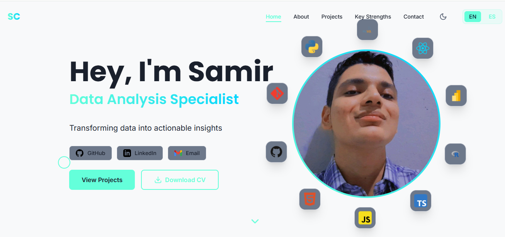

<div align="center">

  <a href="https://portafolio-samir-tau.vercel.app/">
    
  </a>
  
  

  <br>

  <div style="display: flex; justify-content: center; gap: 10px;">
    <a href="https://portafolio-samir-tau.vercel.app/">
      
    </a>
    <a href="https://www.linkedin.com/in/samir-caizapasto/">
      
    </a>
    <a href="mailto:samir.leonardo.caizapasto04@gmail.com">
      
    </a>
  </div>

</div>

---

## 👋 About Me

> *I don't just analyze data. I build the systems that make analysis possible.*

**Junior Data Engineer & Analyst** | **7th Semester  ESPOL, Ecuador**

I am an engineer focused on the **complete data lifecycle**: from building robust architectures (ETL/SQL) to analyzing trends and deploying Machine Learning models. 

Unlike a traditional analyst, my technical background allows me to not only visualize data but also **build and optimize the systems behind it**. My goal is to transform complex raw data into clear, actionable strategies that drive business growth.

### 💼 What I Bring to the Table:
* **Data Engineering:** Automating ETL pipelines and optimizing database queries (40% performance boost).
* **Machine Learning:** Building predictive models for dynamic pricing and real-world scenarios.
* **Business Intelligence:** Identifying financial gaps ($16k+) and visualizing KPIs for decision-making.

---

## 🔭 Currently

<table>
  <tr>
    <td>🔨 <b>Building</b></td>
    <td><a href="https://github.com/Sam-24-dev/Technology-trend-analysis-platform"><b>Technology Trend Analysis Platform</b></a> — End-to-end multi-source ETL pipeline tracking developer trends across <b>GitHub, StackOverflow, and Reddit</b>. Features <b>Pandera</b> quality gates, a <b>DuckDB</b> analytics engine, and fully automated CI/CD workflows (133 passing tests) powering a cross-platform Flutter dashboard.</td>
  </tr>
  <tr>
    <td>📚 <b>Learning</b></td>
    <td><b>Cloud (AWS/GCP) & dbt</b></td>
  </tr>
  <tr>
    <td>👀 <b>Open to</b></td>
    <td><b>Junior Data Engineer / Data Analyst roles</b></td>
  </tr>
  <tr>
    <td>📍 <b>Based in</b></td>
    <td><b>Guayaquil, Ecuador</b></td>
  </tr>
</table>

---

## 🏆 Certifications & Awards

<div align="center">

| 🎖️ Certification / Award | 🏢 Issuer | 📅 | 🔗 |
|:---|:---|:---:|:---:|
| 🌍 **Galactic Problem Solver** — Global Nominee | NASA Space Apps Challenge | Oct 2025 | [📄 Certificate](https://portafolio-samir-tau.vercel.app/certificates/nasa-space-apps-2025.pdf) |
| 📊 **PL-300: Power BI Data Analyst** *(In Progress)* | Microsoft | 2026 | 🔄 |
| 📗 **MO-210: Excel Associate** *(In Progress)* | Microsoft | 2026 | 🔄 |

</div>

---

## 🚀 Featured Project — Highlight

### 🔷 [RideFare: ETL Pipeline & Predictive Price Modeling](https://github.com/Sam-24-dev/RideFare-ETL-Pipeline)
**End-to-End Data Engineering & Machine Learning Project**

> *Simulating price optimization for ride-hailing apps using a data architecture with 1.2 Million records.*

* **🔧 ETL Architecture:** Engineered an automated Python pipeline to ingest **1.2M+ raw records**, using complex SQL JOINs to clean and consolidate a final dataset of **~600k verified trips** in SQLite.
* **🤖 Machine Learning:** Trained a **Random Forest Regressor** to predict dynamic pricing (Baseline RMSE: $9.00). 
* **📊 Key Insight:** Feature importance analysis revealed `distance` (>0.6) and `surge_multiplier` as the absolute dominant factors, proving granular weather data added unnecessary noise.
* **Tech Stack:** Python, SQL, Pandas, Scikit-Learn, Plotly.

<div align="center">
  <a href="https://github.com/Sam-24-dev/RideFare-ETL-Pipeline">
    
  </a>
</div>

---

## 📁 Other Key Projects

### 🛰️ [NASA Space Apps Challenge 2025 - "Weather for All"](https://github.com/JairPalaguachi/Probability)
**Award: Galactic Problem Solver (Global Nominee)**
* **Innovation:** Built a full-stack web app analyzing **10 years of NASA satellite data** across **195+ countries** with **<2s response time** on interactive maps.
* **Impact:** Developed MVP in a **48-hour hackathon**, integrating real-time APIs to predict global extreme weather probabilities.
* **Tech:** Python (Flask), React, TypeScript, Leaflet, Plotly.

<div align="center">
  <a href="https://github.com/JairPalaguachi/Probability">
    
  </a>
  &nbsp;
  <a href="https://www.youtube.com/watch?v=519T9N7JkZU">
    
  </a>
</div>

### 🌾 [Rice Crop Analytics Platform](https://sam-24-dev.github.io/Analisis-Cultivo-Arroz/)
**End-to-end Data Engineering for Agriculture**
* **Result:** Engineered a Python ETL pipeline (covered by 14 unit tests) that modeled a strategic turnaround, projecting an **ROI improvement from -5.58% to +15%** (+20.6 pts) and a **+75% boost in productivity**.
* **Architecture:** Built a robust MySQL -> Python -> JSON pipeline feeding a 5-page interactive dashboard for operational tracking.
* **Tech:** MySQL, Python, Pandas, Pytest, JS/Bootstrap.

<div align="center">
  <a href="https://github.com/Sam-24-dev/Analisis-Cultivo-Arroz">
    
  </a>
  &nbsp;
  <a href="https://sam-24-dev.github.io/Analisis-Cultivo-Arroz/">
    
  </a>
</div>

### 🎮 [eSports Analytics Dashboard - LATAM](https://sam-24-dev.github.io/eSports-Analytics-Dashboard/)
**SQL Database Design & Query Optimization**
* **Achievement:** Optimized a 3NF MySQL database with composite indexes (`idx_competencias_tipo_compid`), reducing execution time by **40%** for complex multi-table queries.
* **Scope:** Processed historical performance data for **15 teams across 8 LATAM countries** managing a **$325,000 total prize pool**.
* **Tech:** MySQL 8.0, Advanced SQL (CTEs, Window Functions), Vanilla JS, Chart.js.

<div align="center">
  <a href="https://github.com/Sam-24-dev/eSports-Analytics-Dashboard">
    
  </a>
  &nbsp;
  <a href="https://sam-24-dev.github.io/eSports-Analytics-Dashboard/">
    
  </a>
</div>

### 🛒 [Grocery Sales BI Dashboard](https://app.powerbi.com/view?r=eyJrIjoiOTk5YTE0MjItZTNiOC00ZmI0LWI1NDUtZDY2ZThjZTYxYmQ0IiwidCI6ImI3YWY4Y2FmLTgzZDgtNDY0NC04NWFlLTMxN2M1NDUyMjNjMSIsImMiOjR9)
**Business Intelligence**
* **Insight:** Analyzed sales distribution across **23 active sellers** ($28.4K avg), uncovering a critical **$16.66K performance gap** between top and bottom performers.
* **Impact:** Identified "Meat" as the top revenue driver (**$80.05K**) and Tulsa as the premier market (**20 top clients**), delivering actionable KPIs for data-driven decisions.
* **Tech:** Power BI, DAX, Excel.

<div align="center">
  <a href="https://app.powerbi.com/view?r=eyJrIjoiOTk5YTE0MjItZTNiOC00ZmI0LWI1NDUtZDY2ZThjZTYxYmQ0IiwidCI6ImI3YWY4Y2FmLTgzZDgtNDY0NC04NWFlLTMxN2M1NDUyMjNjMSIsImMiOjR9">
    
  </a>
</div>

### 🏓 [Statistical Analysis - Ping Pong Precision Model](https://sam-24-dev.github.io/Analisis-Ping-Pong/)
**Scientific Research & Data Modeling**
* **Validation:** Built an automated R pipeline to validate a Negative Binomial Distribution model (k=3, p=0.3) on **309 observations**, achieving a statistically significant **p-value of 0.660**.
* **Impact:** Tracked a mean serve time of **1.945s** (<2s threshold) and exported JSON/PNG assets into a dynamic JS web dashboard.
* **Tech:** R (Tidyverse, ggplot2), HTML/CSS/JS.

<div align="center">
  <a href="https://github.com/Sam-24-dev/Analisis-Ping-Pong">
    
  </a>
  &nbsp;
  <a href="https://sam-24-dev.github.io/Analisis-Ping-Pong/">
    
  </a>
</div>

---

## 🛠️ Technical Stack

<div align="center">

| Category | Technologies |
|:---------|:------------|
| **🔧 Data Engineering & Analysis** |      |
| **🤖 Machine Learning** |   |
| **📊 Visualization & BI** |     |
| **🌐 Web & App** |     |
| **☁️ Cloud & DevOps** |     |

</div>

---

## 📊 GitHub Stats

<div align="center">


</div>

---

## ⏱️ Weekly Coding Activity

<div align="center">

> *Real-time stats powered by [WakaTime](https://wakatime.com) — tracking every line of code I write.*

<table>
  <tr>
    <td>
      <a href="https://wakatime.com/@Sam-24-dev">
        
      </a>
    </td>
  </tr>
</table>
<!--START_SECTION:waka-->
**I'm a Night 🦉** 

```text
🌞 Morning                0 commits           ░░░░░░░░░░░░░░░░░░░░░░░░░   00.00 % 
🌆 Daytime                142 commits         ███████░░░░░░░░░░░░░░░░░░   28.06 % 
🌃 Evening                277 commits         ██████████████░░░░░░░░░░░   54.74 % 
🌙 Night                  87 commits          ████░░░░░░░░░░░░░░░░░░░░░   17.19 % 
```
📅 **I'm Most Productive on Saturday** 

```text
Monday                   60 commits          ███░░░░░░░░░░░░░░░░░░░░░░   11.86 % 
Tuesday                  54 commits          ███░░░░░░░░░░░░░░░░░░░░░░   10.67 % 
Wednesday                81 commits          ████░░░░░░░░░░░░░░░░░░░░░   16.01 % 
Thursday                 99 commits          █████░░░░░░░░░░░░░░░░░░░░   19.57 % 
Friday                   22 commits          █░░░░░░░░░░░░░░░░░░░░░░░░   04.35 % 
Saturday                 126 commits         ██████░░░░░░░░░░░░░░░░░░░   24.90 % 
Sunday                   64 commits          ███░░░░░░░░░░░░░░░░░░░░░░   12.65 % 
```


📊 **This Week I Spent My Time On** 

```text
💬 Programming Languages: 
Markdown                 57 mins             ██████████████████░░░░░░░   71.85 % 
Dart                     18 mins             ██████░░░░░░░░░░░░░░░░░░░   22.84 % 
Python                   4 mins              █░░░░░░░░░░░░░░░░░░░░░░░░   05.31 % 

🐱‍💻 Projects: 
Technology-trend-analysis1 hr 20 mins        █████████████████████████   100.00 % 
```


 Last Updated on 04/03/2026 01:02:07 UTC
<!--END_SECTION:waka-->
</div>

<br>

<div align="center">

### 🤝 Open to Opportunities

I'm a **7th-semester Computer Engineering student at ESPOL** actively looking for **Junior Data Engineer** or **Data Analyst** roles where I can contribute from day one.

<div style="display: flex; justify-content: center; gap: 10px; margin-top: 15px;">
   <a href="https://portafolio-samir-tau.vercel.app/">
      
    </a>
    <a href="https://www.linkedin.com/in/samir-caizapasto/">
      
    </a>
    <a href="mailto:samir.leonardo.caizapasto04@gmail.com">
      
    </a>
</div>

</div>
